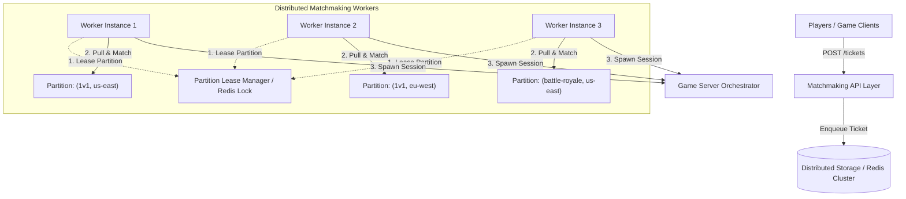

# Scaling Architectural Blueprint: High-Throughput Matchmaking



---

## 1. The Scaling Bottleneck in a Single Worker

At low scale, a single worker service pulling all queued tickets and matching them works fine. However, at **millions of concurrent users**:
1. **Compute Complexity ($O(N^2)$)**: Evaluating candidate pairs globally per sweep becomes extremely expensive as queue depth $N$ grows into thousands per region.
2. **IO & Lock Contention**: A single worker thread becomes CPU/network bound.
3. **No Redundancy**: If the single worker crashes, matchmaking halts globally.

---

## 2. Horizontal Scaling via Partition Leasing

To scale horizontally, we split the global workload into independent **Partitions** defined by **`(GameId, TargetRegion)`**. 

Each `Matchmaking.Worker` instance operates on a subset of active partitions. To prevent two worker instances from matching players in the same partition simultaneously (which leads to race conditions and double-booking), we introduce a **Partition Lease Manager**.

### Partition Lease Mechanics

```csharp
public record PartitionLease
{
    public string GameId { get; init; } = string.Empty;
    public string Region { get; init; } = string.Empty;
    public string WorkerId { get; init; } = string.Empty;
    public DateTimeOffset LeaseExpiresAt { get; init; }
}
```

#### Lease Workflow:
1. **Lease Acquisition**: When a worker starts a sweep cycle, it attempts to acquire a lease for an unassigned partition via the Storage API:
   `POST /storage/partitions/{gameId}/{region}/lease?workerId={workerId}&ttlSeconds=5`
2. **Atomic Lease Grant**: Storage (backed by Redis `SETNX` with TTL or a relational database with optimistic locking) grants the lease to **only one worker** for the specified TTL (e.g., 5 seconds).
3. **Worker Processing**: The worker fetches and matches tickets *only* for partitions it currently holds active leases on.
4. **Heartbeat / Renewal**: As long as the worker is alive, it renews its active leases. If a worker crashes or encounters network partition, its lease expires automatically after 5 seconds, allowing another worker to claim the partition cleanly.

---

## 3. Preventing "Double Booking" & Race Conditions

Even with partition leases, distributed systems require defense-in-depth to guarantee no player is assigned to two sessions simultaneously.

### Strategy 1: Partition Level Isolation (Primary Defense)
Because partition ownership is strictly 1-to-1 between a `(GameId, Region)` partition and a Worker instance:
* Worker 1 processes **`("1v1", "us-east")`**.
* Worker 2 processes **`("1v1", "eu-west")`**.
* Since every ticket is pinned to a single `TargetRegion` at enqueue time, Worker 1 and Worker 2 **never touch the same set of tickets**.

### Strategy 2: Atomic State Transitions / CAS (Secondary Defense)
To prevent race conditions during ticket status updates (e.g. if a lease expires mid-sweep and another worker picks it up):

Use a **Compare-And-Swap (CAS)** operation at the Storage layer when marking tickets as `Matched`:

```http
PUT /storage/tickets/{ticketId}/status
Content-Type: application/json

{
  "ExpectedStatus": "Queued",
  "NewStatus": "Matched",
  "MatchedSessionId": "session-123"
}
```

In Redis, this is executed atomically via a Lua Script:

```lua
-- KEYS[1]: ticket key
-- ARGV[1]: expected status ("Queued")
-- ARGV[2]: new status ("Matched")
-- ARGV[3]: session id

local currentStatus = redis.call("HGET", KEYS[1], "Status")
if currentStatus == ARGV[1] then
    redis.call("HSET", KEYS[1], "Status", ARGV[2], "MatchedSessionId", ARGV[3])
    return 1 -- Success
else
    return 0 -- Failed (already claimed/matched by another worker)
end
```

If the CAS update fails for any player in a matched group, the worker aborts session creation for that group and returns remaining players to the queue.

---

## 4. Performance & Data Structure Optimizations for Millions of Users

To achieve sub-millisecond sweep times per partition at massive scale:

### A. Coarse Latency Bucketing ($O(N^2) \rightarrow O(N)$)
Instead of comparing every ticket against every other ticket ($O(N^2)$), bucket players into coarse latency bins (e.g., 10ms bins: `0-10ms`, `11-20ms`, `21-30ms`):
* Finding eligible peers reduces to inspecting the candidate's own bin and adjacent bins within the `latencyThreshold`.
* Reduces sweep complexity from $O(N^2)$ to $O(N)$.

### B. Redis Sorted Sets (`ZSET`) for Partition Queues
In production storage (Redis), store queued tickets in a `ZSET` per partition where the **score** is `TargetLatency` or `CreatedAt` timestamp:
* **Latency Matching**: Range queries (`ZRANGEBYSCORE`) instantly retrieve tickets with compatible latency.
* **Oldest-First Fairness**: Range queries by timestamp naturally process the oldest waiting tickets first to prevent queue starvation.

---

## Summary Architecture Checklist for Scale

1. **Partition Pinned Tickets**: Fixed `TargetRegion` set at enqueue time.
2. **Distributed Partition Leases**: Workers lease `(GameId, Region)` partitions using Redis locks / leases with automatic TTL expiry.
3. **Consistent Partition Assignment**: Use consistent hashing or Kafka consumer groups to cleanly distribute partitions across N worker nodes.
4. **Atomic Claim (Lua / CAS)**: Update ticket state from `Queued` $\rightarrow$ `Matched` atomically to prevent double allocation.
5. **Latency Binning**: Index tickets by latency bins in Redis Sorted Sets (`ZSET`) to achieve $O(N)$ match lookup performance.
